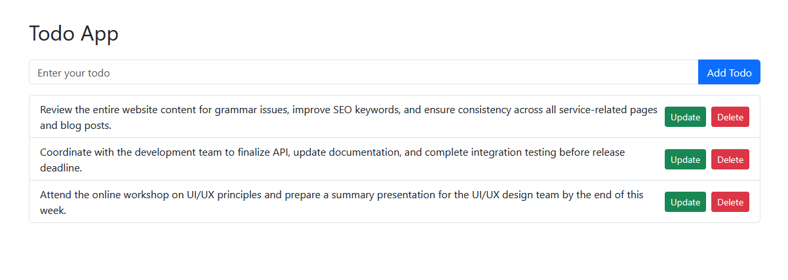
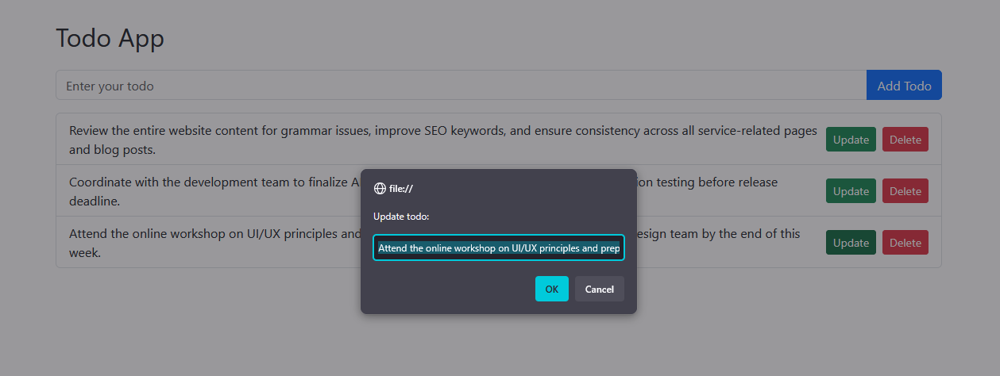

# Basic Todo App

A simple Todo application built with **HTML**, **CSS**, and **Vanilla JavaScript**

## Features

- **Add Todo:** Users can add new tasks to the list.
- **Delete Todo:** Remove tasks from the list .
- **Render Todos:** The list updates automatically after adding current todo.
- **Update Todos:** Edit existing todos.

## How to Run

1. Clone or download this repository.
2. Open the `index.html` file in your web browser.
3. Start adding, deleting, and updating todos.

## System Requirements

- Node.js (To check node.js instaled in computer write "node -v" in command line)
- If not pre installed you can download and install Node.js from: https://nodejs.org

## Sample Output Screenshot

